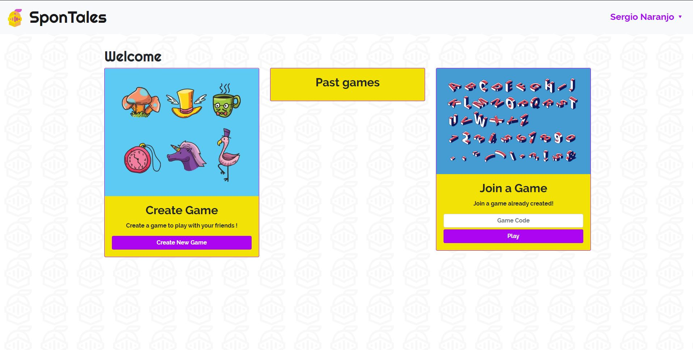

# SponTales
## Description
SponTales is the collaborative game for playing the famous game, Mad Libs, simply sign up, Create a Game and invite your friends by sharing the code of the game and start to craft some Spontaneous Tales! 


## Objectives

The objective of this project was to make a collaborative web-page in which one can play alongside other people the famous game MadLibs. It was required to use Meteor and ReactJS for making it, which became a great way to learn more about these two technologies.  

## Demo
[Here](https://spontales.herokuapp.com/)

## Technologies
 - React
 - Node
 - Mongo
 - Meteor
 

## How to run 
 In the proyect´s root folder, run:
 
 ```
 meteor install
 meteor run
 ``` 

## Authors
* [__Sergio Naranjo Puentes__](https://github.com/snaranjop1)
* [__Gregorio Ospina Arango__](https://github.com/gregorioospina)


## Licence
[](https://opensource.org/licenses/MIT)

This repository has the standard MIT license. You can find it [here.](https://github.com/gregorioospina/spontales/blob/master/LICENSE)
